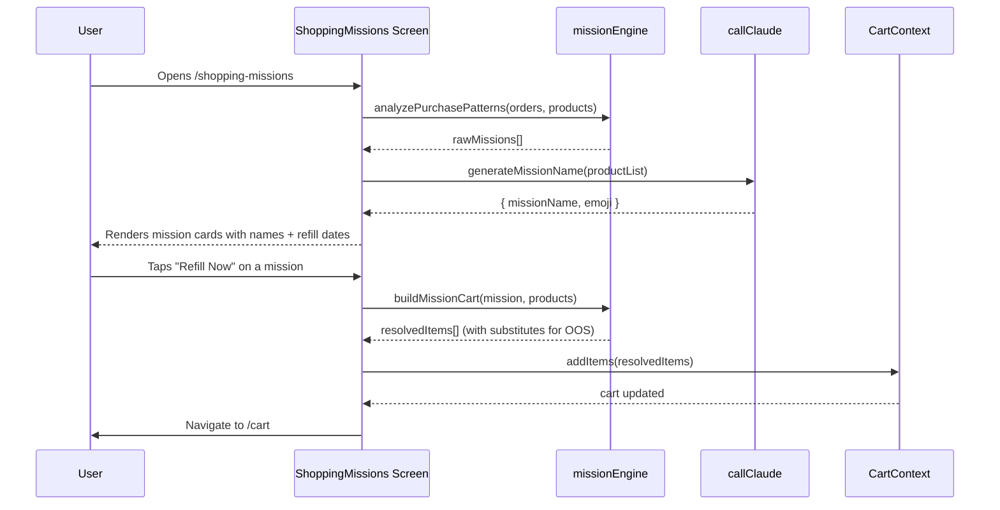
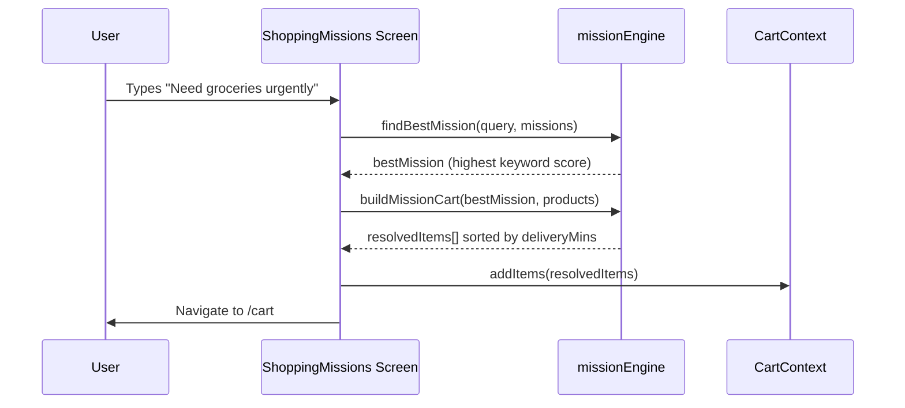

# Design Document: Shopping Missions

## Overview

Shopping Missions is an AI-powered feature for the NeedItNow app that automatically discovers recurring purchase patterns from order history and surfaces them as reusable "missions" — named bundles of products a user regularly buys together. The goal is to eliminate decision fatigue for repeat grocery runs: the user sees a mission card like "Monthly Grocery Refill", taps it, and their cart is auto-populated in one action.

The feature integrates directly into the existing NeedItNow architecture: it reads from `src/data/orders.js`, uses `callClaude` for AI-generated mission names and substitute suggestions, hooks into `CartContext.addItems`, and follows all established patterns (Tailwind styling, mobile-first 390px, `#FF9900` orange CTAs, `rounded-2xl` cards, `animate-fade-in`).

## Architecture

```mermaid
graph TD
    A[orders.js — 8 fake orders] --> B[missionEngine.js — Pattern Analyzer]
    C[products.js — 32 products] --> B
    B --> D[Raw Missions Array]
    D --> E[callClaude — AI Name Generator]
    E --> F[Named Missions Array]
    F --> G[ShoppingMissions screen /shopping-missions]
    G --> H{User Action}
    H -->|Tap mission card| I[buildMissionCart — resolve products + substitutes]
    H -->|Tap Refill Now banner| I
    H -->|Type emergency text| J[findBestMission — NLP match]
    J --> I
    I --> K[CartContext.addItems]
    K --> L[/cart]
    G --> M[Home screen tile — ShoppingMissionsPreview]
```

## Sequence Diagrams

### Main Flow: Tap to Reorder



### Emergency Shopping Flow



## Components and Interfaces

### Component 1: `missionEngine.js` (Pure Utility)

**Purpose**: All pattern analysis, cart building, and scoring logic. Pure functions — no React, no side effects.

**Interface**:
```javascript
/**
 * Analyze order history and return raw mission clusters.
 * Groups products that appear in ≥2 orders within a 40-day window.
 * @param {Order[]} orders
 * @param {Product[]} products
 * @returns {RawMission[]}
 */
export function analyzePurchasePatterns(orders, products) {}

/**
 * Given a raw mission and the full product catalog,
 * resolve each productId to a Product, substituting OOS items.
 * @param {RawMission} mission
 * @param {Product[]} products
 * @returns {ResolvedProduct[]}  // products with qty, possibly substituted
 */
export function buildMissionCart(mission, products) {}

/**
 * Score a text query against all missions and return the best match.
 * Uses keyword overlap between query tokens and product names/categories.
 * @param {string} query
 * @param {NamedMission[]} missions
 * @returns {NamedMission | null}
 */
export function findBestMission(query, missions) {}

/**
 * Given a product that is out of stock, find the best substitute
 * from the catalog (same category, closest price, same brand preferred).
 * @param {Product} original
 * @param {Product[]} catalog
 * @returns {Product | null}
 */
export function findSubstitute(original, catalog) {}

/**
 * Predict the next refill date for a mission based on average interval.
 * @param {Order[]} missionOrders  // orders containing this mission's products
 * @returns {{ avgIntervalDays: number, predictedDaysUntil: number }}
 */
export function predictNextRefill(missionOrders) {}
```

### Component 2: `ShoppingMissions.jsx` (Screen)

**Purpose**: Full-page screen at `/shopping-missions`. Shows mission cards, handles one-tap reorder, emergency input.

**Key State**:
```javascript
const [missions, setMissions] = useState([])       // NamedMission[]
const [loading, setLoading] = useState(true)        // initial AI name gen
const [emergencyQuery, setEmergencyQuery] = useState('')
const [activeMission, setActiveMission] = useState(null) // for loading overlay
```

**Responsibilities**:
- On mount: run `analyzePurchasePatterns`, then call AI for mission names
- Render `<MissionCard>` for each mission
- Show predictive refill banner for missions due ≤ 3 days
- Handle emergency query submission

### Component 3: `MissionCard.jsx` (Sub-component)

**Purpose**: Individual mission card showing name, product count, last order date, refill prediction, and a one-tap CTA.

**Interface**:
```javascript
// Props
{
  mission: NamedMission,
  onRefill: (mission: NamedMission) => void,
  isLoading: boolean,   // shows spinner on this card while cart is building
}
```

**Renders**:
- Mission name + emoji
- Product count badge
- Last Ordered date (formatted)
- Predicted Refill date with urgency coloring
- Product thumbnail strip (first 3 product images)
- "Refill Now" CTA button

### Component 4: `ShoppingMissionsPreview` (Home screen tile)

**Purpose**: Small teaser tile on HomeScreen (just like `DailyEssentialsPreview`) that shows the top 1–2 missions and links to `/shopping-missions`.

**Interface**:
```javascript
// No props — reads orders/products internally, same as other home tiles
function ShoppingMissionsPreview() {}
```

## Data Models

### `RawMission`
```javascript
{
  id: string,                    // e.g. "mission_grocery"
  productIds: string[],          // product IDs in this cluster
  orderDates: string[],          // ISO dates of orders containing this cluster
  avgIntervalDays: number,       // average days between repurchases
  lastOrderedDaysAgo: number,    // daysAgo of most recent order in this cluster
  predictedDaysUntil: number,    // days until next predicted refill
}
```

### `NamedMission` (extends `RawMission`)
```javascript
{
  ...RawMission,
  name: string,                  // AI-generated e.g. "Monthly Grocery Refill"
  emoji: string,                 // AI-generated e.g. "🛒"
}
```

### `ResolvedProduct` (extends `Product` from products.js)
```javascript
{
  ...Product,                    // id, name, brand, price, image, inStock, deliveryMins
  qty: number,                   // from order history average
  isSubstitute: boolean,         // true if original was OOS
  originalProductId?: string,    // set if isSubstitute = true
}
```

**Validation Rules**:
- `productIds` must have ≥ 2 entries (single-product missions are not surfaced)
- `avgIntervalDays` must be between 7 and 90 (filter out outliers)
- `predictedDaysUntil` clamped to 0 minimum (overdue missions show "Due Now")

## Algorithmic Pseudocode

### Pattern Analysis Algorithm

```javascript
function analyzePurchasePatterns(orders, products) {
  // Step 1: Build co-occurrence matrix
  // For each pair of products that appear in the same order,
  // increment their co-occurrence count.
  const coOccurrence = {}  // "pA_pB" → count

  for (const order of orders) {
    const ids = order.items.map(i => i.productId).sort()
    for (let i = 0; i < ids.length; i++) {
      for (let j = i + 1; j < ids.length; j++) {
        const key = `${ids[i]}_${ids[j]}`
        coOccurrence[key] = (coOccurrence[key] || 0) + 1
      }
    }
  }

  // Step 2: Find product groups appearing together ≥ 2 times
  // Use a greedy clustering: start from highest co-occurrence pairs
  // and expand clusters when products co-occur with ≥ 2 cluster members.
  const strongPairs = Object.entries(coOccurrence)
    .filter(([_, count]) => count >= 2)
    .sort((a, b) => b[1] - a[1])

  const clusters = []  // each cluster is a Set of productIds

  for (const [key] of strongPairs) {
    const [idA, idB] = key.split('_')
    // Find if either product is already in a cluster
    let existingCluster = clusters.find(c => c.has(idA) || c.has(idB))
    if (existingCluster) {
      existingCluster.add(idA)
      existingCluster.add(idB)
    } else {
      clusters.push(new Set([idA, idB]))
    }
  }

  // Step 3: For each cluster, find the orders that contain it and compute interval
  return clusters
    .filter(c => c.size >= 2)
    .map(cluster => {
      const productIds = [...cluster]
      const relevantOrders = orders.filter(o =>
        productIds.some(pid => o.items.some(i => i.productId === pid))
      ).sort((a, b) => a.daysAgo - b.daysAgo)

      const { avgIntervalDays, predictedDaysUntil } = predictNextRefill(relevantOrders)

      const lastOrderedDaysAgo = Math.min(...relevantOrders.map(o => o.daysAgo))

      return {
        id: `mission_${productIds[0]}`,
        productIds,
        orderDates: relevantOrders.map(o => o.date),
        avgIntervalDays,
        lastOrderedDaysAgo,
        predictedDaysUntil,
      }
    })
    .filter(m => m.avgIntervalDays >= 7 && m.avgIntervalDays <= 90)
}
```

**Preconditions:**
- `orders` is a non-empty array of valid order objects
- `products` catalog is available for validation
- Each order has `items[]` with `productId` fields

**Postconditions:**
- Returns array of `RawMission` objects
- Each mission has ≥ 2 products
- `avgIntervalDays` is between 7 and 90
- No duplicate product IDs within a single mission

**Loop Invariant (co-occurrence loop):**
- All previously processed order pairs have been recorded in `coOccurrence`
- `coOccurrence` values are always positive integers

### Substitute Finding Algorithm

```javascript
function findSubstitute(original, catalog) {
  // Filter to same category, in stock, not the same product
  const candidates = catalog.filter(p =>
    p.id !== original.id &&
    p.category === original.category &&
    p.inStock
  )

  if (candidates.length === 0) return null

  // Score each candidate: same brand = +10, price within 20% = +5
  const priceMin = original.price * 0.8
  const priceMax = original.price * 1.2

  return candidates
    .map(p => ({
      product: p,
      score:
        (p.brand === original.brand ? 10 : 0) +
        (p.price >= priceMin && p.price <= priceMax ? 5 : 0),
    }))
    .sort((a, b) => b.score - a.score)[0]?.product ?? candidates[0]
}
```

**Preconditions:**
- `original` is a valid Product with `category`, `brand`, `price`
- `catalog` is the full products array

**Postconditions:**
- Returns a Product from `catalog` (never `original`)
- The returned product has `inStock = true`
- Same brand preferred; otherwise closest price in same category

### Mission Name Generation (AI Call)

```javascript
// System prompt added to SYSTEM in claude.js
const SYSTEM_SHOPPING_MISSIONS = `
You are a shopping assistant for Amazon Now India.
Given a list of product names, generate a short human-friendly mission name
and a single emoji that best represents the shopping category.
Respond ONLY with valid JSON. No markdown, no explanation.
Format: { "name": "Monthly Grocery Refill", "emoji": "🛒" }
Name must be ≤ 4 words, friendly, category-focused.
`

// Prompt builder
function shoppingMissions(productNames) {
  return {
    systemPrompt: SYSTEM_SHOPPING_MISSIONS,
    userMessage: `Products: ${productNames.join(', ')}`,
  }
}
```

**Mock response** (added to `mockLLM.js`):
```javascript
// Detect by systemPrompt keyword "mission name"
if (systemPrompt.includes('mission name')) {
  const msg = userMessage.toLowerCase()
  if (msg.includes('atta') || msg.includes('oil') || msg.includes('salt')) {
    return JSON.stringify({ name: 'Monthly Grocery Refill', emoji: '🛒' })
  }
  if (msg.includes('pampers') || msg.includes('johnson') || msg.includes('formula')) {
    return JSON.stringify({ name: 'Baby Care Essentials', emoji: '👶' })
  }
  if (msg.includes('colgate') || msg.includes('dove') || msg.includes('whisper')) {
    return JSON.stringify({ name: 'Personal Care Refill', emoji: '🪥' })
  }
  if (msg.includes('harpic') || msg.includes('surf') || msg.includes('colin')) {
    return JSON.stringify({ name: 'Home Cleaning Bundle', emoji: '🧹' })
  }
  return JSON.stringify({ name: 'Regular Essentials', emoji: '🛍️' })
}
```

## Key Functions with Formal Specifications

### `predictNextRefill(missionOrders)`

**Preconditions:**
- `missionOrders.length >= 1`
- Each order has `daysAgo` (non-negative integer)

**Postconditions:**
- `avgIntervalDays >= 0`
- `predictedDaysUntil >= 0` (clamped at 0 for overdue)
- If only 1 order exists, `avgIntervalDays` defaults to 30 (assumed monthly)

**Logic:**
```javascript
function predictNextRefill(missionOrders) {
  if (missionOrders.length < 2) {
    const lastDaysAgo = missionOrders[0]?.daysAgo ?? 30
    return {
      avgIntervalDays: 30,
      predictedDaysUntil: Math.max(0, 30 - lastDaysAgo),
    }
  }
  // Sort ascending by daysAgo (most recent = lowest daysAgo)
  const sorted = [...missionOrders].sort((a, b) => a.daysAgo - b.daysAgo)
  const intervals = []
  for (let i = 1; i < sorted.length; i++) {
    intervals.push(sorted[i].daysAgo - sorted[i - 1].daysAgo)
  }
  const avg = Math.round(intervals.reduce((s, v) => s + v, 0) / intervals.length)
  const lastDaysAgo = sorted[0].daysAgo
  return {
    avgIntervalDays: avg,
    predictedDaysUntil: Math.max(0, avg - lastDaysAgo),
  }
}
```

### `findBestMission(query, missions)`

**Preconditions:**
- `query` is a non-empty string
- `missions` is a (possibly empty) array of `NamedMission`

**Postconditions:**
- Returns `null` if `missions` is empty or no tokens match
- Returns the mission with the highest token overlap score
- Scoring is case-insensitive

**Logic:**
```javascript
function findBestMission(query, missions) {
  if (!missions.length) return null
  const tokens = query.toLowerCase().split(/\s+/)
  const scored = missions.map(m => {
    const haystack = [
      m.name,
      ...m.productIds.map(id => getProductById(id)?.name ?? ''),
      ...m.productIds.map(id => getProductById(id)?.category ?? ''),
    ].join(' ').toLowerCase()
    const score = tokens.filter(t => haystack.includes(t)).length
    return { mission: m, score }
  })
  const best = scored.sort((a, b) => b.score - a.score)[0]
  return best.score > 0 ? best.mission : null
}
```

## Example Usage

```jsx
// 1. On mount in ShoppingMissions.jsx
useEffect(() => {
  async function loadMissions() {
    setLoading(true)
    const rawMissions = analyzePurchasePatterns(orders, products)

    // Generate AI names for each raw mission
    const named = await Promise.all(
      rawMissions.map(async (m) => {
        const productNames = m.productIds
          .map(id => getProductById(id)?.name ?? id)
        const { systemPrompt, userMessage } = PROMPTS.shoppingMissions(productNames)
        const raw = await callClaude(systemPrompt, userMessage)
        const parsed = safeParseJSON(raw) ?? { name: 'My Mission', emoji: '🛒' }
        return { ...m, name: parsed.name, emoji: parsed.emoji }
      })
    )
    setMissions(named)
    setLoading(false)
  }
  loadMissions()
}, [])

// 2. One-tap reorder
function handleRefill(mission) {
  setActiveMission(mission.id)
  const resolvedItems = buildMissionCart(mission, products)
  addItems(resolvedItems)
  navigate('/cart')
}

// 3. Emergency shopping
function handleEmergencySubmit(e) {
  e.preventDefault()
  const best = findBestMission(emergencyQuery, missions)
  if (!best) return
  const resolvedItems = buildMissionCart(best, products)
    .sort((a, b) => a.deliveryMins - b.deliveryMins)  // fastest delivery first
  addItems(resolvedItems)
  navigate('/cart')
}
```

## Correctness Properties

*A property is a characteristic or behavior that should hold true across all valid executions of a system — essentially, a formal statement about what the system should do. Properties serve as the bridge between human-readable specifications and machine-verifiable correctness guarantees.*

### Property 1: Mission detection from co-occurring products

*For any* order history containing at least two orders that share a common product, `analyzePurchasePatterns` must return at least one mission containing that product.

**Validates: Requirements 1.1, 1.2, 2.1**

### Property 2: Mission cart completeness with substitutes

*For any* generated mission and product catalog, `buildMissionCart` must return a list where every product in the mission is represented — either by the original (if `inStock = true`) or by a valid substitute from the same category (if `inStock = false` and a substitute exists).

**Validates: Requirements 5.2, 7.1**

### Property 3: Substitute is always in stock and same category

*For any* out-of-stock product and product catalog, `findSubstitute` must return either `null` (if no in-stock product of the same category exists) or a product where `inStock = true` and `category === original.category`.

**Validates: Requirements 7.2, 7.3, 7.4**

### Property 4: Refill interval bounds

*For any* set of orders passed to `analyzePurchasePatterns`, every resulting mission must have `avgIntervalDays` between 7 and 90 inclusive.

**Validates: Requirements 1.4, 6.1**

### Property 5: No duplicate products in a mission cart

*For any* mission, `buildMissionCart` must return a list where each product ID appears at most once.

**Validates: Requirements 5.3**

### Property 6: Emergency mission match on keyword overlap

*For any* query string containing at least one token that appears in a mission's name, product names, or product categories, `findBestMission` must return a non-null mission.

**Validates: Requirements 8.2, 8.3**

### Property 7: Emergency cart is sorted by delivery speed

*For any* emergency query that resolves to a mission, the resolved products added to the cart must be sorted in ascending order by `deliveryMins`.

**Validates: Requirements 8.4, 8.6**

### Property 8: Pattern analysis idempotence

*For any* fixed order history, calling `analyzePurchasePatterns` twice with the same input must return missions with identical product ID sets (deterministic output).

**Validates: Requirements 1.5**

### Property 9: Mission card renders all required fields

*For any* `NamedMission` object, the rendered `MissionCard` component must include the mission name, product count, last ordered date, and predicted next refill date as visible text content.

**Validates: Requirements 4.2**

### Property 10: AI mission name is a non-empty short string

*For any* list of product names passed to the AI Name Generator mock, the returned `name` field must be a non-empty string containing ≤ 4 space-separated words.

**Validates: Requirements 3.1, 3.2**

## Error Handling

### Error Scenario 1: AI name generation fails

**Condition**: `callClaude` throws or returns unparseable JSON
**Response**: `safeParseJSON` returns `null`; the mission falls back to a deterministic name derived from the dominant product category (e.g., "grocery" → "Grocery Refill 🛒")
**Recovery**: Mission is still surfaced with the fallback name; no user-visible error

### Error Scenario 2: No patterns found

**Condition**: `analyzePurchasePatterns` returns an empty array (e.g., all orders are one-offs)
**Response**: The screen renders an empty state: "No missions yet. Shop a few more times and we'll detect your patterns."
**Recovery**: User is not blocked; the feature gracefully degrades

### Error Scenario 3: All products OOS

**Condition**: Every product in a mission is out of stock and no substitutes exist
**Response**: `buildMissionCart` returns an empty array; the "Refill Now" button is disabled with tooltip "Products unavailable right now"
**Recovery**: Mission card remains visible but CTA is disabled

### Error Scenario 4: Emergency query matches nothing

**Condition**: `findBestMission` returns `null`
**Response**: UI shows "Couldn't identify a mission for that query. Try 'monthly groceries' or 'baby items'."
**Recovery**: Emergency input field is cleared; user can try again

## Testing Strategy

### Unit Testing Approach

- Test `analyzePurchasePatterns` with the real `orders.js` data to verify it produces expected clusters (baby care: p017+p018, grocery: p009+p014+p015)
- Test `predictNextRefill` with edge cases: single order (should default to 30-day interval), orders with consistent intervals, orders with irregular intervals
- Test `findSubstitute` for same-brand preference, price proximity, and OOS filtering
- Test `findBestMission` with matching queries, non-matching queries, and empty mission arrays
- Test `buildMissionCart` to verify no duplicate product IDs in output

### Property-Based Testing Approach

**Property Test Library**: fast-check

All six correctness properties above are candidates for property-based testing using fast-check's generators to produce arbitrary orders, product catalogs, and query strings.

### Integration Testing Approach

- Mount `ShoppingMissions` screen with mock `callClaude` and verify mission cards render with AI-generated names
- Tap "Refill Now" on a mission and verify `CartContext` receives the correct `addItems` call
- Submit emergency query and verify navigation to `/cart`

## Performance Considerations

- `analyzePurchasePatterns` runs synchronously on 8 fake orders — O(n²) co-occurrence is fine at this scale
- AI calls for mission names are parallelized with `Promise.all` to minimize perceived load time
- `LoadingDots` component (already in codebase) used during initial AI name generation

## Security Considerations

- No user PII is sent to the AI; only product names are included in the prompt
- `safeParseJSON` wrapper prevents JSON parse crashes from malformed AI responses

## Dependencies

- `src/data/orders.js` — order history source
- `src/data/products.js` — product catalog + `getProductById`
- `src/utils/claude.js` — `callClaude`, `PROMPTS` (new `shoppingMissions` entry needed)
- `src/utils/mockLLM.js` — new mock branch for "mission name" system prompt
- `src/utils/helpers.js` — `safeParseJSON`, `formatPrice`
- `src/context/CartContext.jsx` — `addItems`
- `src/components/LoadingDots.jsx` — loading state
- `lucide-react` — icons (existing dep)
