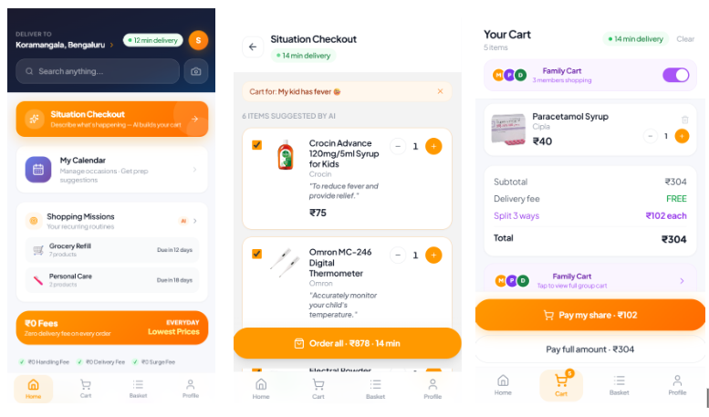

# NeedItNow

> AI-powered ultra-fast delivery — built for Amazon HackOn

A mobile-first React web app that reimagines urgent grocery and essentials delivery. Six AI-driven features help you discover, decide, and order in seconds. Real AWS backend with DynamoDB persistence and Cognito authentication.

---

## Sample UI



---

## Features

### AI-Powered

| Feature | Route | What it does |
|---|---|---|
| **Situation Checkout** | `/situation` → `/situation-checkout` | Describe any situation in plain text — "my kid has fever", "guests arriving in 1 hr" — and Gemini builds a contextual cart of 4–6 products |
| **Smart Reorder** | `/my-basket` (Soon tab) | Analyses 6 months of order history and predicts what you're running low on, with urgency levels |
| **Photo to Cart** | `/photo-to-cart` | Upload or capture any product image — Gemini Vision identifies it and finds the Amazon Now equivalent |
| **Calendar Shopping** | `/calendar/:eventId` | Upcoming events (birthdays, festivals, dinner parties) automatically trigger event-prep shopping lists |
| **Shopping Missions** | `/shopping-missions` | Pure algorithm detects recurring purchase patterns from order history; Gemini names each mission |
| **Daily Essentials** | `/my-basket` (Today tab) | AI predicts what will run out by tomorrow based on typical consumption rates |

### Core App

- **Panic Mode** — Emergency one-tap order with live countdown timer (11 min delivery)
- **Group Cart** — Collaborative cart with multiple members, bill split per person
- **My Basket** — Three-tab hub: Today essentials / Soon predictions / Custom lists
- **Full Calendar** — Interactive monthly calendar, add occasions, navigate to event shopping
- **Smart Lists** — Pre-built saved carts for common shopping runs
- **Smart Presets** — Saved search filter configurations (price range, category, sort)
- **Simulated Payment** — UPI (4 apps), Cards, Wallets, COD with 5-step processing animation
- **Order History** — Live orders from DynamoDB merged with seed data, grouped by month with reorder

---

## Tech Stack

| Layer | Technology |
|---|---|
| Frontend | React 19 + Vite 8 |
| Styling | Tailwind CSS 3, custom utilities (glassmorphism nav, safe-bottom, scrollbar-hide) |
| Routing | React Router v7 |
| Icons | lucide-react |
| Fonts | Plus Jakarta Sans (UI), Syne (display/hero), Inter (body) |
| Auth | Amazon Cognito — Hosted UI, Authorization Code + PKCE (raw fetch, no Amplify) |
| Database | Amazon DynamoDB (`needitnow-orders`, `needitnow-users`) |
| API | AWS API Gateway + Lambda (Node.js 20.x, ESM) |
| AI Primary | Gemini 2.5 Flash (Google) |
| AI Fallback | Groq Llama-3.3-70B Versatile |
| Hosting | AWS Amplify (CI/CD from GitHub) |

---

## Architecture

```
React SPA (mobile, 375px)
        │
        ├── POST /ai          ──► Lambda ──► Gemini 2.5 Flash (primary)
        │                                └── Groq Llama-3.3-70B (fallback)
        │
        ├── POST /order       ──► Lambda ──► DynamoDB (needitnow-orders)
        ├── GET  /orders/:id  ──► Lambda ──► DynamoDB
        ├── POST /user        ──► Lambda ──► DynamoDB (needitnow-users)
        └── GET  /user/:id    ──► Lambda ──► DynamoDB
```

Authentication: Cognito Hosted UI → Authorization Code + PKCE → JWT stored in `localStorage`. Session auto-restores on reload. Demo mode available without Cognito configuration.

---

## Project Structure

```
needitnow/
├── src/
│   ├── App.jsx                          # Router, auth gate, providers
│   ├── main.jsx                         # React 19 entry point
│   ├── index.css                        # Tailwind + custom utilities
│   ├── context/
│   │   ├── AuthContext.jsx              # Cognito PKCE auth, demo fallback
│   │   └── CartContext.jsx              # In-memory cart state
│   ├── data/
│   │   ├── products.js                  # 32 products across 6 categories (INR)
│   │   ├── orders.js                    # 20 seed orders over 6 months + stats
│   │   ├── calendarEvents.js            # 5 upcoming events + per-type fallbacks
│   │   └── users.js                     # 3 group cart members + seed items
│   ├── utils/
│   │   ├── claude.js                    # LLM client — USE_MOCK toggle, 6 prompts
│   │   ├── mockLLM.js                   # Hardcoded mock responses (no API cost)
│   │   ├── api.js                       # REST client for DynamoDB routes
│   │   ├── missionEngine.js             # Pure pattern detection + cart building
│   │   └── helpers.js                   # formatPrice, safeParseJSON, timeAgo, etc.
│   ├── components/
│   │   ├── BottomNav.jsx                # Glassmorphism nav — 4 tabs, cart badge
│   │   ├── CategoryBrowse.jsx           # 7 category sections + product strips
│   │   ├── HomeSections.jsx             # Deal strips, bento section, coupons
│   │   ├── MissionCard.jsx              # Shopping mission with refill prediction
│   │   ├── QuantityStepper.jsx          # +/− qty control (sm/md sizes)
│   │   ├── DeliveryBadge.jsx            # Green "X min" delivery pill
│   │   ├── LoadingDots.jsx              # 3-dot AI loading spinner
│   │   └── AvatarPill.jsx               # User avatar with initials
│   └── screens/                         # 21 screens
│       ├── HomeScreen.jsx               # Main feed
│       ├── SearchScreen.jsx             # Search + filters + smart presets
│       ├── MyBasket.jsx                 # 3-tab: Today / Soon / My Lists
│       ├── CalendarScreen.jsx           # Interactive calendar + event management
│       ├── CalendarShopping.jsx         # AI event-prep shopping list
│       ├── SituationLanding.jsx         # Situation input + quick chips
│       ├── SituationCheckout.jsx        # AI situation cart (Gemini)
│       ├── PanicMode.jsx                # Emergency order + countdown timer
│       ├── PhotoToCart.jsx              # AI image recognition (Gemini Vision)
│       ├── SmartReorder.jsx             # AI reorder predictions
│       ├── ShoppingMissions.jsx         # Pattern-detected missions (AI-named)
│       ├── DailyEssentials.jsx          # Daily prediction bento grid
│       ├── GroupCart.jsx                # Collaborative cart, live member updates
│       ├── CartScreen.jsx               # Cart + group mode toggle
│       ├── PaymentScreen.jsx            # UPI / Card / Wallet / COD
│       ├── PaymentProcessing.jsx        # 5-step animation, saves to DynamoDB
│       ├── OrderConfirmed.jsx           # Success + ETA progress bar
│       ├── ProfileScreen.jsx            # Profile edit + live order history
│       ├── LoginScreen.jsx              # Cognito sign-in or demo mode
│       ├── SmartLists.jsx               # Pre-built saved carts
│       └── SmartPresets.jsx             # Saved filter presets
├── lambda/
│   ├── index.mjs                        # Unified Lambda handler (AI + DynamoDB)
│   ├── package.json                     # @aws-sdk/client-dynamodb, lib-dynamodb
│   └── requirements.txt
└── public/
    └── products/                        # 32 product images (p001–p032.jpg)
```

---

## Quick Start

```bash
git clone https://github.com/utk1college/NeedItNow.git
cd NeedItNow
npm install
npm run dev
```

Open `http://localhost:5173` — click **Continue as Demo User** to skip auth.

### Environment Variables

Create a `.env` file for real API and auth:

```env
# Lambda API Gateway URL (handles AI + DynamoDB routes)
VITE_API_URL=https://<your-api-gateway-url>
VITE_LLM_PROXY_URL=https://<your-api-gateway-url>

# Amazon Cognito (leave blank for demo mode)
VITE_COGNITO_DOMAIN=<your-pool>.auth.<region>.amazoncognito.com
VITE_COGNITO_CLIENT_ID=<client-id>
VITE_COGNITO_REDIRECT=http://localhost:5173
```

### Mock vs Real AI

Toggle line 12 in `src/utils/claude.js`:

```js
const USE_MOCK = true;   // free, instant — no API calls (default for dev)
const USE_MOCK = false;  // real Gemini 2.5 Flash via Lambda
```

All AI features have hardcoded fallbacks — the app works fully in mock mode.

---

## AWS Services

| Service | Purpose |
|---|---|
| **AWS Amplify Hosting** | Frontend deployment, auto-deploy on push to `master` |
| **AWS Lambda** (Node.js 20.x) | Unified backend: AI proxy + DynamoDB routes |
| **AWS API Gateway** | HTTP routes to Lambda (v1 and v2 event shapes supported) |
| **Amazon DynamoDB** | `needitnow-orders` table (GSI: `userId-timestamp-index`) + `needitnow-users` table |
| **Amazon Cognito** | User pool, Hosted UI, PKCE auth flow |
| **Google AI Studio** | Gemini 2.5 Flash — primary LLM |
| **Groq** | Llama-3.3-70B — fallback LLM |

### Lambda Environment Variables

```
GEMINI_API_KEY   — Google AI Studio key
GROQ_API_KEY     — Groq API key
AWS_REGION       — DynamoDB region (default: ap-south-1)
ORDERS_TABLE     — DynamoDB table name (default: needitnow-orders)
USERS_TABLE      — DynamoDB table name (default: needitnow-users)
```

---

## Build

```bash
npm run build     # production build → dist/
npm run preview   # preview production build
npm run lint      # ESLint check
```

Amplify auto-deploys on push to `master` via `amplify.yml`.

---

## Product Catalog

32 products across 6 categories — all prices in INR, real product images:

- **Health** (8): Dettol, Calpol, Omron thermometer, Electral ORS, Vicks, Band-Aid, Glucose-D, Ibuprofen
- **Grocery** (8): Aashirvaad Atta, Amul Milk, Lay's, Thums Up, Britannia cookies, Fortune oil, Tata Salt, Maggi
- **Baby** (4): Pampers, Johnson's powder, Mamy Poko, Nestlé formula
- **Cleaning** (4): Harpic, Surf Excel, Colin, Scotch-Brite
- **Party** (4): Paper plates, balloons, cake candles, Lay's party pack
- **Personal Care** (4): Colgate, Dove body wash, Gillette, Whisper

---

## Cart & Checkout Flow

```
Any screen → addItems() → /cart → /payment → /payment-processing → /order-confirmed
                                                      ↓
                                              saveOrder() → DynamoDB
```

Cart is in-memory (React Context). Orders persist to DynamoDB after the 5-step payment animation. ProfileScreen fetches live orders from DynamoDB and merges with seed data.

---

Built for **Amazon HackOn** · React 19 + Vite 8 + Tailwind CSS 3 · AWS Amplify + Lambda + DynamoDB + Cognito
